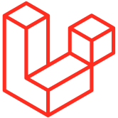

<!-- PROJECT LOGO OR BANNER -->
<br />
<div align="center">
  <a href="https://github.com/MGuyF/blog-laravue-demo">
    
  </a>

  <h3 align="center">blog-laravue-demo — Full-Stack Laravel &amp; Vue Blog</h3>

  <p align="center">
    A mini blog to write, publish and manage articles, built with Laravel and an Inertia-powered Vue 3 frontend.
    <br />
    <a href="https://github.com/MGuyF/blog-laravue-demo/issues/new?labels=bug">Report Bug</a>
    ·
    <a href="https://github.com/MGuyF/blog-laravue-demo/issues/new?labels=enhancement">Request Feature</a>
    ·
    <a href="https://blog-laravue-demo-dbx4.onrender.com/">View Live Demo</a>
  </p>
</div>

<!-- BADGES -->
<div align="center">

[![License][license-shield]][license-url]
[![GitHub Issues][issues-shield]][issues-url]
[![Live Demo][demo-shield]][demo-url]
[![Docker][docker-shield]][docker-url]

</div>

---

### About The Project

blog-laravue-demo is a small publishing platform that keeps articles and their authors in one place. Visitors
register and log in, then create, read, edit and delete posts made of a title and a body of content — every post
is stored with the author who wrote it. Laravel handles routing, validation and persistence, while Inertia.js
renders the Vue 3 pages directly from the controllers, so no separate API layer is needed.

**Demo account:** `test@example.com` / `password` — created by the database seeder for local development. The
hosted demo runs on open registration, so you can also create your own account.

#### Built With

* [![Laravel][laravel-shield]][laravel-url]
* [![Vue.js][vue-shield]][vue-url]
* [![Inertia.js][inertia-shield]][inertia-url]
* [![Tailwind CSS][tailwind-shield]][tailwind-url]
* [![TypeScript][ts-shield]][ts-url]
* [![SQLite][sqlite-shield]][sqlite-url]

---

### Getting Started

#### Prerequisites

* PHP 8.2+ (`pdo_sqlite` is required when using the default SQLite database)
* Composer 2
* Node.js 18+ (20 recommended)

```sh
php --version
composer --version
node --version
```

#### Installation & Setup

1. Clone the repository:
   ```sh
   git clone https://github.com/MGuyF/blog-laravue-demo.git
   cd blog-laravue-demo
   ```
2. Install and migrate the backend:
   ```sh
   cd vue-starter-kit
   composer install
   cp .env.example .env
   php artisan key:generate
   touch database/database.sqlite
   php artisan migrate
   ```
3. Install the frontend dependencies (the Vue app lives beside the Laravel app):
   ```sh
   npm install
   ```
4. Configure your local environment variables in the `.env` file:
   ```env
   # vue-starter-kit/.env
   APP_NAME="Mini Blog"
   APP_URL=http://localhost:8000

   DB_CONNECTION=sqlite   # default — uses the file created in step 2
   # DB_CONNECTION=mysql  # or pgsql
   # DB_DATABASE=blog
   # DB_USERNAME=root
   # DB_PASSWORD=
   ```
5. Start the backend and the frontend:
   ```sh
   composer run dev    # server + queue + logs + Vite in a single command
   ```
   Or run them in two terminals:
   ```sh
   php artisan serve   # http://localhost:8000
   npm run dev         # Vite dev server
   ```
   Optionally seed the demo account (`php artisan db:seed`), then open http://localhost:8000.

#### Deployment

A production `Dockerfile` (PHP 8.3, Node, built assets, SQLite and migrations on boot) and a
[Render](https://render.com) blueprint (`render.yaml`) ship with the repository. To build and run the
container locally:

```sh
docker build -t blog-laravue-demo .
docker run -p 10000:10000 blog-laravue-demo
```

The container serves the application on port `10000`.

---

### Usage

```javascript
import { router } from '@inertiajs/vue3';

// Log in, then publish an article — every request is an Inertia visit
router.post('/login', { email: 'test@example.com', password: 'password' });
router.post('/posts', { title: 'Hello world', content: 'My first article.' });
```

Post routes are protected by the `auth` middleware, and each post is stored with the authenticated author:

```php
Auth::user()->posts()->create($request->validate([
    'title' => 'required|string|max:255',
    'content' => 'required|string',
]));
```

_For the full route list, run `php artisan route:list`._

---

### Roadmap

- [x] Session authentication with email-based login
- [x] Post management (create, list, view, edit, delete)
- [x] Author attribution on every article
- [x] Responsive interface with Tailwind CSS and dark mode support
- [x] Docker and Render deployment setup

---

### Contributing

This project is a personal showcase and its source is **not open for code contributions**. The
[License](#license) reserves all rights, so forking or modifying the code is not permitted.

Feedback is still welcome:

1. Found a bug or unexpected behaviour? [Open an issue](https://github.com/MGuyF/blog-laravue-demo/issues/new?labels=bug).
2. Have an idea or suggestion? [Request a feature](https://github.com/MGuyF/blog-laravue-demo/issues/new?labels=enhancement).
3. Please report issues only — pull requests containing code changes will not be accepted.

---

### License

Copyright © 2026 MGuyF. All rights reserved.
This project is for personal showcase only. Unauthorized copying or modification of this code is strictly prohibited.

---

### Contact

MGuyF - [@MGuyF](https://github.com/MGuyF) - 2000291gf@gmail.com

Project Link: [https://github.com/MGuyF/blog-laravue-demo](https://github.com/MGuyF/blog-laravue-demo)

<!-- MARKDOWN LINK & BADGE REFERENCES -->
[license-shield]: https://img.shields.io/badge/License-Proprietary-red?style=for-the-badge
[license-url]: https://github.com/MGuyF/blog-laravue-demo#license
[issues-shield]: https://img.shields.io/github/issues/MGuyF/blog-laravue-demo?style=for-the-badge
[issues-url]: https://github.com/MGuyF/blog-laravue-demo/issues
[demo-shield]: https://img.shields.io/badge/Live_Demo-Render-46E3B7?style=for-the-badge&logo=render
[demo-url]: https://blog-laravue-demo-dbx4.onrender.com/
[docker-shield]: https://img.shields.io/badge/Docker-2496ED?style=for-the-badge&logo=docker&logoColor=white
[docker-url]: https://github.com/MGuyF/blog-laravue-demo/blob/main/Dockerfile
[laravel-shield]: https://img.shields.io/badge/Laravel_12-FF2D20?style=for-the-badge&logo=laravel&logoColor=white
[laravel-url]: https://laravel.com/
[vue-shield]: https://img.shields.io/badge/Vue_3-4FC08D?style=for-the-badge&logo=vuedotjs&logoColor=white
[vue-url]: https://vuejs.org/
[inertia-shield]: https://img.shields.io/badge/Inertia.js_2-9553E9?style=for-the-badge&logo=inertia&logoColor=white
[inertia-url]: https://inertiajs.com/
[tailwind-shield]: https://img.shields.io/badge/Tailwind_CSS_4-06B6D4?style=for-the-badge&logo=tailwindcss&logoColor=white
[tailwind-url]: https://tailwindcss.com/
[ts-shield]: https://img.shields.io/badge/TypeScript_5-3178C6?style=for-the-badge&logo=typescript&logoColor=white
[ts-url]: https://www.typescriptlang.org/
[sqlite-shield]: https://img.shields.io/badge/SQLite-003B57?style=for-the-badge&logo=sqlite&logoColor=white
[sqlite-url]: https://www.sqlite.org/
